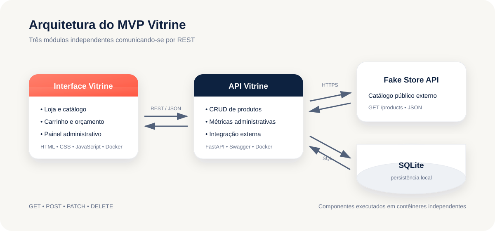

# Vitrine - loja e painel de gestão

A Vitrine é um MVP acadêmico composto por uma loja responsiva e um painel administrativo. Clientes podem pesquisar produtos, usar filtros, favoritar itens, montar um carrinho e acompanhar uma meta de orçamento. Administradores sincronizam o catálogo da Fake Store API e gerenciam produtos persistidos pela API própria.



## Componentes

1. **Interface Vitrine:** HTML, CSS e JavaScript, servidos pelo Nginx.
2. **API Vitrine:** FastAPI e SQLite, mantida em repositório separado.
3. **Fake Store API:** serviço público externo usado para obter o catálogo inicial.

## Funcionalidades

- Catálogo responsivo com pesquisa, categorias e ordenação.
- Detalhes de produto, favoritos e carrinho persistente no navegador.
- Meta de orçamento com indicador de progresso.
- Painel com métricas de catálogo e alertas de estoque baixo.
- Cadastro, edição e exclusão de produtos pela API própria.
- Sincronização de produtos da Fake Store.
- Mensagens de carregamento, sucesso e erro.

## Execução com Docker

Clone os repositórios do front-end e da API na mesma pasta, mantendo a estrutura:

```text
pasta-do-projeto/
├── prototipo-vitrine/
└── vitrine-api/
```

Na raiz deste repositório, execute:

```bash
docker compose up --build
```

Depois, acesse:

- Interface: `http://localhost:3000`
- Swagger da API: `http://localhost:8000/docs`

O volume `vitrine-data` preserva o banco SQLite mesmo após reiniciar os contêineres.

## Execução local sem Docker

Com a API rodando na porta 8000, execute na raiz do front-end:

```bash
python3 -m http.server 3000
```

Acesse `http://localhost:3000`. Para usar outra URL de API, altere `config.js`.

## Métodos HTTP usados pela interface

| Método | Rota | Uso |
|---|---|---|
| GET | `/api/products` | Listar e pesquisar produtos |
| POST | `/api/products` | Cadastrar produto |
| PATCH | `/api/products/{id}` | Editar preço, estoque, status e demais dados |
| DELETE | `/api/products/{id}` | Excluir produto |
| POST | `/api/products/sync` | Importar e atualizar o catálogo externo |
| GET | `/api/dashboard` | Carregar as métricas administrativas |

## API externa

A aplicação utiliza a [Fake Store API](https://fakestoreapi.com/) por meio da rota pública `GET /products`. Não há redirecionamento para o serviço externo: a API Vitrine consulta os dados, normaliza a resposta e salva os produtos no SQLite.

- Serviço gratuito voltado a testes e protótipos.
- Não exige cadastro nem chave para consultar produtos.
- O projeto de referência possui [licença MIT](https://github.com/keikaavousi/fake-store-api/blob/master/LICENSE).
- Rota consumida: `https://fakestoreapi.com/products`.

## Estrutura

```text
.
├── docs/
│   ├── arquitetura.svg
│   ├── checklist-entrega.md
│   └── roteiro-video.md
├── app.js
├── config.js
├── index.html
├── styles.css
├── Dockerfile
├── docker-compose.yml
└── nginx.conf
```

## Materiais de entrega

- [Roteiro do vídeo](docs/roteiro-video.md)
- [Checklist final](docs/checklist-entrega.md)

## Observação acadêmica

As compras são simuladas e não envolvem pagamentos reais. A função principal do projeto é demonstrar componentização, comunicação REST, persistência e gestão de catálogo.
